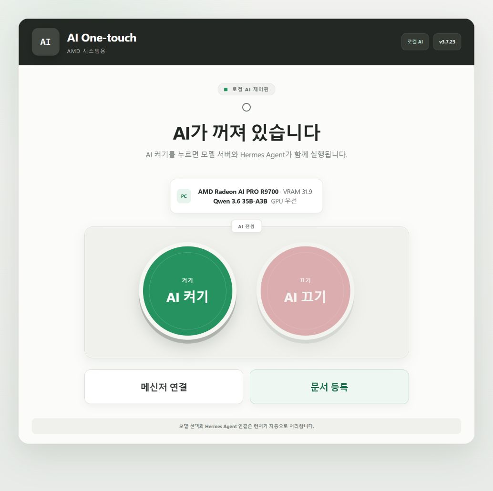
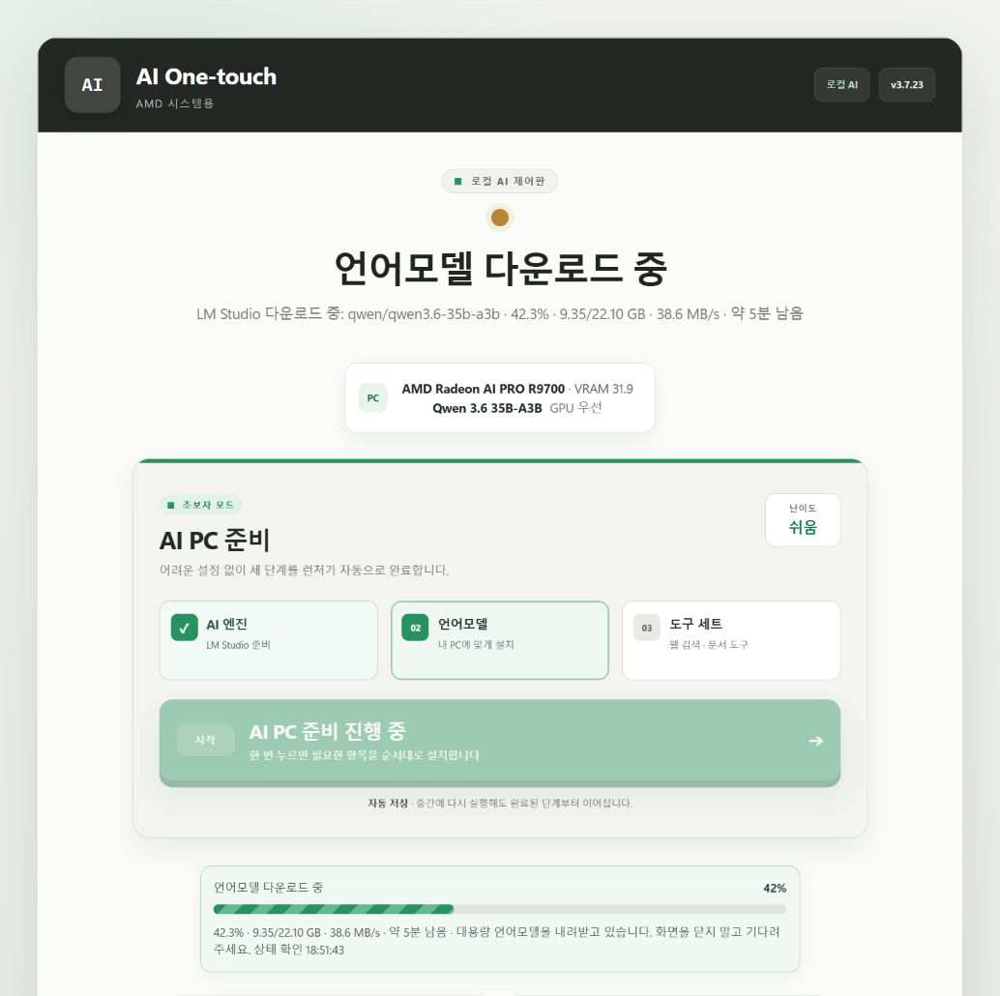
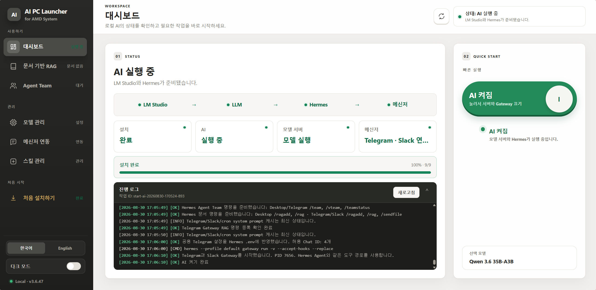

# AI One-touch

> AMD 시스템에서 로컬 언어모델과 AI Agent 환경을 쉽게 설치하고 관리하기 위한 Windows 런처입니다.

AI One-touch는 **LM Studio 기반 로컬 LLM**, **Hermes Agent**, **Telegram·Slack 메신저 연동**, **웹 검색**, **문서 기반 RAG**를 하나의 화면에서 준비하고 실행할 수 있도록 도와줍니다.

복잡한 명령어 입력 없이 그래픽카드를 확인하고, PC의 VRAM에 맞는 모델과 실행 설정을 선택할 수 있도록 구성했습니다.

> 이 프로젝트는 LM Studio, Element Labs, Nous Research, AMD, Telegram, Slack 또는 각 언어모델 제공자의 공식 제품이나 공식 배포판이 아닙니다.

## 다운로드

가장 간단한 방법은 저장소 상단의 초록색 **Code** 버튼을 누른 뒤 **Download ZIP**을 선택하는 것입니다.

1. 내려받은 `ai_agent-main.zip`의 압축을 해제합니다.
2. 압축을 푼 폴더의 `downloads`로 들어갑니다.
3. 처음 설치한다면 `v3.7.24`, 기존 대시보드와 최신 RAG를 사용하려면 `v3.6.63` 폴더를 엽니다.
4. 폴더 안의 `README_KO.txt`를 확인한 뒤 `1_Install_...bat` 파일을 **관리자 권한으로 실행**합니다.

> 두 설치본은 자체서명 MSIX입니다. 설치 배치파일이 함께 제공된 공개 인증서를 등록하므로 Windows 관리자 권한이 필요합니다. 인증서 지문은 각 폴더의 `package-info.json`에서 확인할 수 있으며 개인키는 포함되어 있지 않습니다.

| 버전 | 권장 대상 | 특징 |
|---|---|---|
| **v3.7.24** | 처음 설치하는 사용자 | 초보자용 UI, 자세한 다운로드 진행 상태, GPU 교체 자동 감지 |
| **v3.6.63** | 기존 화면과 상세 관리 기능을 선호하는 사용자 | 대시보드 중심 UI, Qwen3 Embedding 기반 문서 RAG, 상세 진행 로그 |

처음 사용하는 경우 **v3.7**을 권장합니다.

## 주요 기능

- AMD 그래픽카드와 VRAM 자동 확인
- PC 사양에 맞는 언어모델과 컨텍스트 설정 안내
- AMD ROCm 우선 실행 및 Vulkan 호환 모드 지원
- KV 캐시 8비트(Q8) 기본 설정
- LM Studio 설치와 로컬 모델 서버 실행
- Hermes Agent 자동 설치 및 로컬 LLM 연결
- Telegram·Slack 메신저 연동
- 웹 검색 도구와 문서 도구 설치
- PDF·Word·Excel·PowerPoint·CSV·TXT·Markdown·JSON 문서 등록
- 로컬 문서 기반 RAG 검색
- AI 켜기·끄기와 현재 실행 상태 확인
- 런처 초기화 및 내려받은 언어모델 관리

## 화면

### v3.7 — 처음 사용하기 쉬운 화면

설치할 항목과 현재 진행 상태를 큰 화면에서 순서대로 보여줍니다. 언어모델을 내려받는 동안에는 진행률, 내려받은 용량, 속도, 남은 시간과 마지막 상태 확인 시각을 표시합니다.





### v3.6 — 상세 대시보드

LM Studio, 언어모델, Hermes Agent와 메신저의 상태를 한 화면에서 확인하고 진행 로그를 상세하게 볼 수 있습니다.



## 시스템 요구 사항

| 항목 | 요구 사항 |
|---|---|
| 운영체제 | Windows 10 또는 Windows 11 64비트 |
| GPU | AMD Radeon·Radeon PRO 계열 권장 |
| 메모리 | 선택한 모델과 컨텍스트 길이에 따라 달라짐 |
| 저장 공간 | 런처 외에 언어모델당 약 6~23GB 이상 필요 |
| 네트워크 | LM Studio, Hermes Agent와 언어모델을 처음 설치할 때 필요 |

GPU와 VRAM이 부족하면 모델 실행 속도가 느려지거나 로딩에 실패할 수 있습니다. 이 경우 더 작은 모델을 선택하거나 컨텍스트 길이와 KV 캐시 설정을 낮춰 주세요.

## 설치 방법

1. 저장소의 **Code → Download ZIP**으로 전체 파일을 내려받습니다.
2. `ai_agent-main.zip`의 압축을 완전히 해제합니다. 압축 파일 내부에서 설치 BAT을 바로 실행하지 마세요.
3. `downloads/v3.7.24` 또는 `downloads/v3.6.63` 폴더를 엽니다.
4. `1_Install_...bat` 파일을 우클릭하여 **관리자 권한으로 실행**합니다.
5. 설치가 끝나면 바탕화면 또는 시작 메뉴에서 AI One-touch를 실행합니다.
6. 런처를 열고 사용할 모델과 실행 방식을 확인합니다.
7. **AI 환경 설치 시작** 또는 **처음 설치하기**를 누릅니다.
8. 설치가 완료되면 **AI 켜기**를 눌러 모델 서버와 Hermes Agent를 실행합니다.

- [v3.7 설치·사용 가이드](docs/v3.7/guide.html)
- [v3.6 설치·사용 가이드](docs/v3.6/guide.html)

### 언어모델 다운로드가 오래 걸릴 때

Qwen 고성능 모델은 약 16~22GB를 내려받을 수 있습니다. 진행 막대가 천천히 움직이더라도 다음 값이 갱신되고 있다면 정상적으로 진행 중입니다.

- 다운로드 진행률
- 내려받은 용량 / 전체 용량
- 다운로드 속도
- 예상 남은 시간
- 마지막 상태 확인 시각

설치 중에는 런처와 LM Studio를 강제로 종료하지 마세요.

## AI 켜기와 끄기

- **AI 켜기**: 선택한 언어모델을 LM Studio에 불러오고 Hermes Agent와 설정된 메신저 연결을 시작합니다.
- **AI 끄기**: Hermes Agent와 모델 서버를 순서대로 종료하고 사용 중인 VRAM을 해제합니다.

Windows 작업 관리자에서 GPU 사용률이 남아 보이더라도 전용 GPU 메모리와 Compute 사용량이 내려갔다면 정상적으로 종료된 상태일 수 있습니다.

## 언어모델 변경

언어모델을 변경할 때는 반드시 다음 순서를 지켜 주세요.

1. 대시보드에서 **AI 끄기**
2. 모델 관리에서 새 모델 선택
3. 모델 설정 저장
4. 대시보드로 돌아가 **AI 켜기**

AI가 실행 중인 상태에서 모델만 변경하면 이전 모델이 메모리에 남거나 설정이 즉시 반영되지 않을 수 있습니다.

### GPU를 교체한 경우

v3.7.24부터는 마지막 실행 때의 GPU 이름·VRAM·권장 등급과 현재 하드웨어를 비교합니다. GPU가 바뀌거나 VRAM 차이가 크면 예전 PC에서 저장된 모델을 계속 사용하지 않고 현재 GPU에 맞는 권장 모델을 다시 선택합니다.

- 16GB급 GPU: `Gemma 4 26B A4B IT` 권장
- 32GB급 GPU: `Qwen 3.6 35B-A3B` 권장
- 하드웨어가 그대로인 경우: 사용자가 저장한 모델 선택 유지

GPU 교체 전에 내려받은 모델 파일은 자동으로 삭제하지 않습니다. 새 권장 모델이 설치되어 있지 않다면 **AI 켜기** 시 최초 한 번 다운로드가 진행될 수 있습니다.

## 모델 선택 안내

| 모델 | 권장 VRAM | 용도 |
|---|---:|---|
| 경량 모델 | 8GB 이상 | 빠른 시작, 간단한 작업 |
| Gemma 4 26B A4B IT | 14~16GB 이상 | 16GB급 GPU의 속도·품질 균형 |
| Qwen 3.6 27B | 24GB 이상 | 문서 처리와 일반 추론 |
| Qwen 3.6 35B-A3B | 32GB 이상 | 복잡한 추론과 품질 우선 작업 |
| Qwen 3.8 27B | 32GB 이상 | 품질을 우선하는 최신 선택지 |

실제 요구 메모리는 컨텍스트 길이, KV 캐시 양자화, GPU 드라이버와 다른 실행 프로그램에 따라 달라질 수 있습니다.

## 문서 기반 RAG

PDF, Word, Excel, PowerPoint, CSV, TXT, Markdown, JSON 문서를 런처에 등록하여 로컬 지식베이스로 사용할 수 있습니다.

등록한 문서는 사용자의 PC 안에서 청크와 임베딩으로 처리됩니다. v3.6.63은 Qwen3-Embedding-0.6B를 사용하며, 질문을 특정 업무 유형으로 고정하지 않고 자연어 그대로 검색한 뒤 관련 문서와 작업 규칙을 적용해 답변합니다. 일반 대화와 문서 질문을 구분하려면 질문 앞에 `/rag`를 붙일 수 있습니다.

```text
/rag 이 계약서의 만기일과 담당자를 표로 정리해줘
```

민감한 문서를 등록하기 전에는 메신저 연결 범위와 Hermes Agent의 도구 권한을 확인하세요.

## 메신저 연동

Hermes Agent Gateway를 이용하여 Telegram 또는 Slack에서 로컬 AI와 대화할 수 있습니다.

- Telegram: Bot Token과 허용할 Chat ID 필요
- Slack: App Token, Bot Token과 허용 사용자 설정 필요
- 외부에서 들어오는 요청은 반드시 허용 목록을 설정하여 제한할 것을 권장

토큰과 개인 설정 파일은 GitHub나 다른 공개 장소에 업로드하지 마세요.

## 초기화와 삭제

배포 파일에 포함된 Reset Tool에서 다음 작업을 수행할 수 있습니다.

- 런처 실행 환경과 사용자 설정 초기화
- LM Studio와 Hermes Agent 연결 설정 정리
- 런처가 관리하는 언어모델 확인 및 선택 삭제
- 전체 초기화 후 재설치 준비

런처 초기화와 언어모델 삭제는 서로 다른 작업입니다. 내려받은 모델을 보존하려면 초기화 전 Reset Tool의 선택 내용을 확인하세요.

## 개인정보와 네트워크 사용

언어모델 추론과 등록 문서 처리는 기본적으로 사용자의 PC에서 수행됩니다. 다만 다음 기능은 인터넷 연결 또는 외부 서비스 통신이 필요합니다.

- LM Studio, Hermes Agent와 언어모델 다운로드
- 웹 검색과 URL 내용 확인
- Telegram·Slack 메시지 송수신
- 사용자가 별도로 연결한 외부 API 및 스킬

외부 서비스에는 각 서비스의 개인정보 처리방침과 이용약관이 적용됩니다.

## 문제 해결

문제가 발생하면 현재 단계, 오류 문구, 런처 버전, Windows 버전, GPU·VRAM, 선택 모델과 실행 런타임을 확인해 주세요.

재현 가능한 오류는 [GitHub Issues](https://github.com/iamchobosalsal/ai_agent/issues)에 화면 캡처와 로그를 함께 등록해 주세요. Bot Token, Chat ID, 사용자 경로와 같은 개인정보는 반드시 가린 후 첨부해야 합니다.

## Third-Party Software Notice

본 런처는 LM Studio, Hermes Agent, 제3자 LLM 모델, Telegram·Slack 등 제3자가 제공하는 소프트웨어, 오픈소스 구성 요소, 모델 및 서비스를 쉽게 설치하고 연동할 수 있도록 지원하는 독립적인 도구입니다.

LM Studio 데스크톱 앱과 언어모델 파일은 본 저장소에 포함하거나 재배포하지 않으며, 사용자의 PC에서 각 제공자가 안내하는 공식 배포 경로를 통해 내려받습니다. 각 구성 요소의 사용, 수정, 상업적 이용 및 재배포에는 해당 제공자의 라이선스와 이용 조건이 적용됩니다.

본 프로젝트는 LM Studio, Element Labs, Nous Research, AMD, Telegram, Slack 또는 각 언어모델 제공자의 공식 제품이나 공식 배포판이 아니며, 별도의 명시가 없는 한 해당 업체 및 프로젝트와의 제휴·보증·승인·후원을 의미하지 않습니다.

자세한 내용은 [THIRD_PARTY_NOTICES.md](THIRD_PARTY_NOTICES.md)를 확인해 주세요.

## 라이선스 및 재배포

본 런처 자체의 실행 파일, 설치 구성, 사용자 인터페이스, 문서 및 제작자가 직접 작성한 구성 요소의 권리는 제작자에게 있습니다.

공식 배포본을 정상적으로 내려받아 설치하고 사용하는 데 필요한 범위를 제외하고, 사전 서면 허가 없이 이를 수정·판매·재패키징하거나 수정된 버전을 공식 배포본인 것처럼 표시하여 배포하는 행위를 금지합니다.

저장소가 공개되어 있다는 사실만으로 오픈소스 라이선스 또는 별도의 재배포 권한이 부여되는 것은 아닙니다. 자세한 이용 조건은 [LICENSE.md](LICENSE.md)를 확인해 주세요.

Copyright © 2026 [iamchobosalsal](https://github.com/iamchobosalsal). All rights reserved.

## 관련 프로젝트

- [LM Studio](https://lmstudio.ai/)
- [Hermes Agent](https://github.com/NousResearch/hermes-agent)
- [Telegram Bots](https://core.telegram.org/bots)
- [Slack API](https://api.slack.com/)
