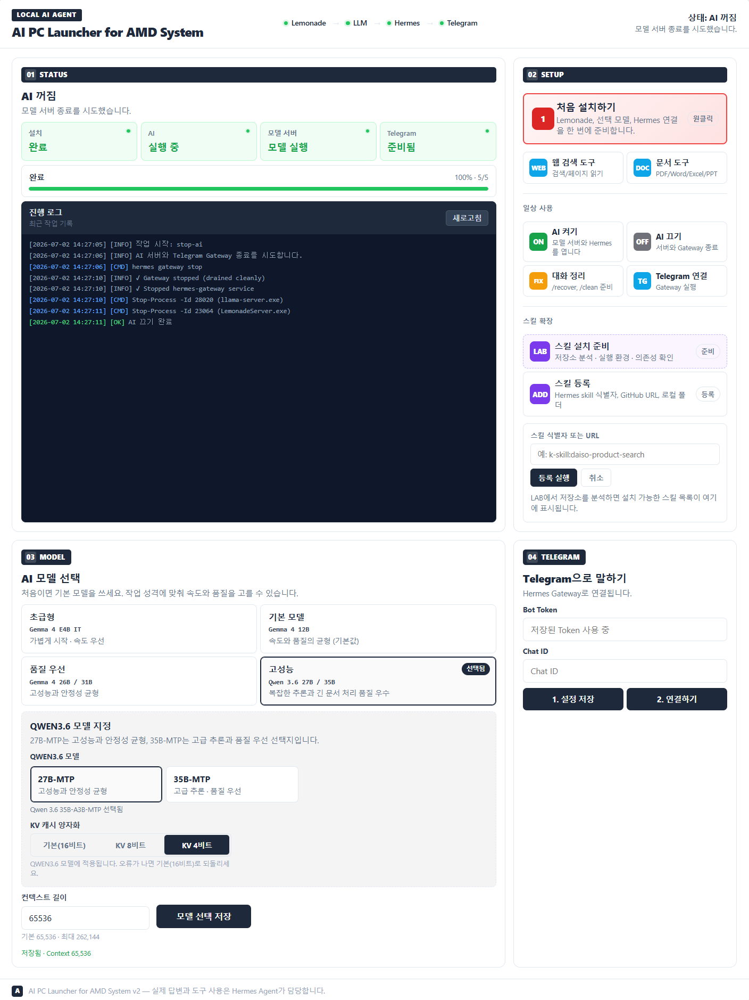

# AI PC Launcher for AMD System

> Windows에서 Local AI Agent 환경을 쉽게 설치하고 연결하기 위한 통합 런처입니다.  
> Lemonade, LLM, Hermes Agent, Telegram 연동을 한 번의 흐름으로 준비할 수 있도록 도와줍니다.



## Overview

**AI PC Launcher for AMD System**은 AI Agent 설치와 연동이 어려운 사용자를 위해 만들어진 Windows용 설치/연동 런처입니다.

Local LLM, Agent, 메신저 연동 환경은 여러 프로그램 설치, 모델 선택, 모델 서버 실행, API 연결, Gateway 설정 등 여러 단계가 필요합니다. 이 과정은 AI Agent를 처음 사용하는 사용자에게 진입 장벽이 높을 수 있습니다.

이 런처는 기존에 있는 클라이언트와 도구들을 한 화면에서 설치하고 연결할 수 있도록 구성하여, 사용자가 복잡한 설정 과정을 최소화하고 PC에서 실행되는 Local AI Agent 환경을 빠르게 준비할 수 있도록 돕는 것을 목표로 합니다.

## GPU / VRAM 선택 가이드

런처에서 제공하는 모델은 VRAM 용량에 따라 아래와 같이 선택하는 것을 권장합니다.

| 모델 | 권장 VRAM |
| --- | --- |
| Gemma 4 4B | 8GB |
| Gemma 4 12B | 8GB ~ 16GB |
| Gemma 4 26B | 16GB ~ 32GB |
| Gemma 4 31B / Qwen 3.6 27B / 35B | 32GB |

> 컨텍스트 길이, KV 캐시 양자화 설정에 따라 실제 요구 VRAM은 위 기준보다 늘어날 수 있습니다. VRAM이 부족하면 한 단계 낮은 모델 또는 KV 캐시 4비트/8비트 양자화 옵션을 사용해 주세요.

## Purpose

이 프로젝트의 목적은 다음과 같습니다.

- AI Agent 설치가 어려운 사용자를 위한 쉬운 진입점 제공
- Local LLM 실행 환경 구성 단순화
- Lemonade, LLM, Hermes Agent, Telegram 연동 과정 지원
- 웹 검색, 문서 도구, 대화 정리 등 Agent 기능 확장을 위한 기반 제공
- AI PC에서 로컬 기반 Agent 활용 경험 제공
- 교육, 데모, PoC 환경에서 빠르게 Local AI Agent 환경을 구성할 수 있는 도구 제공

## Main Workflow

```text
Lemonade → LLM → Hermes Agent → Telegram
```

기본 동작 흐름은 다음과 같습니다.

1. Lemonade 실행 환경을 준비합니다.
2. 사용자가 선택한 LLM 모델을 준비하고 실행합니다.
3. Hermes Agent와 모델 서버를 연결합니다.
4. Hermes Gateway를 통해 Telegram과 연결합니다.
5. 사용자는 Telegram을 통해 Local AI Agent와 대화할 수 있습니다.

## Key Features

### 1. One-click setup

Lemonade, 선택 모델, Hermes Agent 연결을 한 번에 준비할 수 있는 설치 메뉴를 제공합니다.

- Lemonade 설치 준비
- LLM 모델 선택 및 실행 준비
- Hermes Agent 연결
- Telegram Gateway 연동 준비

### 2. Status dashboard

현재 설치 및 실행 상태를 한 화면에서 확인할 수 있습니다.

- 설치 완료 여부
- AI 실행 상태
- 모델 서버 실행 상태
- Telegram 준비 상태
- 진행 로그 및 작업 ID 확인

### 3. Model selection

사용 목적에 맞춰 모델을 선택할 수 있습니다.

- 초급형 모델
- 기본 모델
- 품질 우선 모델
- 고성능 모델
- Qwen 3.6 계열 모델 선택
- KV 캐시 양자화 옵션
- 컨텍스트 길이 설정

### 4. Daily-use controls

설치 후 일상적으로 사용할 수 있는 제어 버튼을 제공합니다.

- AI 켜기
- AI 끄기
- 대화 정리
- Telegram 연결

### 5. Skill expansion

Agent의 기능을 확장하기 위한 스킬 설치 및 등록 메뉴를 제공합니다.

- 웹 검색 도구
- 문서 도구
- 스킬 설치 준비
- Hermes skill 식별자, GitHub URL, 로컬 폴더 기반 스킬 등록

### 6. Telegram integration

Hermes Gateway를 통해 Telegram과 연결할 수 있습니다.

- Bot Token 저장
- Chat ID 입력
- Telegram 연결 실행
- 메신저 기반 Agent 사용 준비

## Use Cases

이 런처는 다음과 같은 사용자에게 적합합니다.

- AI Agent를 사용해보고 싶지만 설치 과정이 어려운 사용자
- Local LLM, Agent, Telegram 연동을 직접 구성하기 어려운 사용자
- AI PC에서 로컬 기반 개인 비서 환경을 구성하고 싶은 사용자
- 웹 검색, 문서 분석, 파일 정리, 대화 정리 같은 Agent 기능을 쉽게 사용하고 싶은 사용자
- 교육, 데모, PoC 환경에서 빠르게 Local AI Agent 구성을 보여줘야 하는 사용자

## System Requirements

| Item | Requirement |
| --- | --- |
| OS | Windows 10/11 64-bit 권장 |
| Hardware | AMD Ryzen / Radeon / Radeon PRO / EPYC 기반 시스템 권장 |
| Network | 설치 파일 및 모델 다운로드를 위한 인터넷 연결 필요 |
| Permission | 일부 설치 및 실행 과정에서 관리자 권한이 필요할 수 있음 |
| Messenger | Telegram Bot Token 및 Chat ID 필요 |

> 실제 요구 사양은 선택하는 LLM 모델, 컨텍스트 길이, KV 캐시 설정, GPU/VRAM 구성에 따라 달라질 수 있습니다.

## Installation

사용자 설치 방법은 별도 HTML 매뉴얼을 참고해 주세요.

```text
docs/install_guide.html
```

기본 설치 흐름은 다음과 같습니다.

1. GitHub Releases 페이지에서 최신 설치 파일을 다운로드합니다.
2. `AI_PC_Launcher_Setup_vX.X.X.exe`를 실행합니다.
3. 런처에서 **처음 설치하기**를 선택합니다.
4. 사용할 LLM 모델을 선택합니다.
5. Telegram Bot Token과 Chat ID를 입력합니다.
6. 설정을 저장한 뒤 Telegram 연결을 실행합니다.
7. 상태 화면에서 설치, AI, 모델 서버, Telegram 상태를 확인합니다.
8. AI Agent를 실행하고 Telegram에서 대화를 시작합니다.

## Recommended Repository Structure

Windows 실행 파일은 repository에 직접 커밋하기보다 GitHub Releases에 업로드하는 것을 권장합니다.

```text
Repository
├─ README.md
├─ docs/
│  ├─ install_guide.html
│  └─ images/
│     └─ ai-pc-launcher-screenshot.png
├─ src/ or launcher files
└─ Releases
   └─ AI_PC_Launcher_Setup_v2.0.0.exe
```

## Suggested Release File Names

공개 배포용 파일명 예시는 다음과 같습니다.

AI_PC_Launcher_Setup_v2.0.0.exe

외부 공개용으로 배포하는 경우에는 브랜드 및 상표 사용 정책을 확인한 뒤 프로젝트명과 파일명을 결정하는 것을 권장합니다.

## Security Notice

이 런처는 Local AI Agent 실행 환경을 구성하기 위해 외부 프로그램 설치, 모델 다운로드, 로컬 서버 실행, 메신저 Gateway 연결 등의 작업을 수행할 수 있습니다.

사용자는 설치 전 다음 내용을 확인해야 합니다.

- 어떤 프로그램이 설치되는지
- 어떤 폴더에 파일이 저장되는지
- 외부 네트워크 연결이 필요한지
- 관리자 권한이 필요한지
- 삭제 방법은 무엇인지
- 백신 또는 Windows SmartScreen 경고가 발생할 수 있는지

공식 배포 시에는 코드 서명 인증서 적용을 권장합니다.

## Uninstall

삭제 방법은 Reset_Tool.exe 를 이용하여 가능합니다.

삭제 시 다음 항목이 삭제 됩니다.
- 런처 프로그램 삭제
- Lemonade 관련 파일 삭제
- Hermes Agent 관련 파일 삭제
- 임시 로그 및 캐시 파일 삭제

언어 모델은 별도로 삭제 할 수 있습니다.

## Third-Party Software and Redistribution Notice

본 런처는 Lemonade, Hermes Agent, LLM 모델 등 제3자가 제공하는 오픈소스 소프트웨어와 서비스를 보다 쉽게 설치하고 연동할 수 있도록 지원하는 도구입니다.
각 오픈소스 프로그램, 라이브러리 및 모델의 저작권과 권리는 해당 개발자 및 권리자에게 있으며, 사용·수정·상업적 이용·재배포에는 각 구성 요소의 라이선스와 이용 조건이 적용됩니다.
본 런처를 이용하여 구성된 환경을 상업적으로 사용하는 경우, 사용자는 각 소프트웨어와 모델의 라이선스 및 이용 조건을 직접 확인하고 준수해야 합니다. 라이선스 위반이나 상업적 이용으로 발생하는 문제에 대해 본 런처의 제작자는 책임을 지지 않습니다.
다만, 본 런처 자체의 실행 파일, 설치 구성, 화면, 문서 및 제작자가 직접 작성한 구성 요소를 사전 허가 없이 수정·복제·판매·재패키징하거나, 수정된 버전을 공식 배포본인 것처럼 배포하는 행위를 금지합니다.
이를 위반한 경우 제작자는 배포 중단 및 삭제를 요청하고, 저작권법 등 관련 법령에 따른 조치를 취할 수 있습니다.
본 프로젝트는 Lemonade, Nous Research, Telegram 또는 각 LLM 모델 제공자의 공식 제품이나 공식 배포판이 아니며, 별도의 명시가 없는 한 해당 업체와의 제휴·보증·후원을 의미하지 않습니다.
